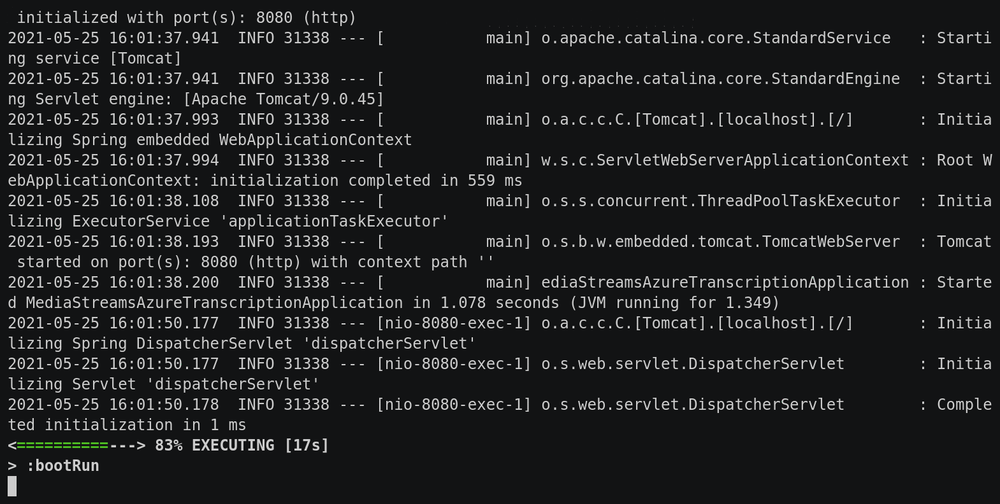

# Realtime Transcription Demo

This demo shows how to forward audio data from a Twilio media stream to Azure for realtime transcription.



## Running the project

### Set up your Azure resources

Follow [the Azure docs](https://docs.microsoft.com/azure/cognitive-services/speech-service/overview#try-the-speech-service-for-free) to set up Cognitive Services Speech. You need to get *the subscription key* and *location/region*. Export these as environment variables and run the app with:

```
export AZURE_SPEECH_SUBSCRIPTION_KEY="......."
export AZURE_SERVICE_REGION="......"
```

### Build and run the app

*Requires Java 11 or newer*

With the environment variables exported, run the app with:

```
./gradlew clean bootRun
```

The app will start and will listen on `localhost:8080`

### Configuring Twilio

#### This is easiest with the Twilio CLI

1. Find an available phone number `twilio api:core:available-phone-numbers:local:list --country-code="US" --voice-enabled --properties="phoneNumber"`
1. Purchase the phone number (where +123456789 is a number you found) `twilio api:core:incoming-phone-numbers:create --phone-number="+123456789"`
1. Configure the phone number to use your app `twilio phone-numbers:update +123456789 --voice-url=http://localhost:8080/twiml`

#### Using the Twilio web console

1. Access the Twilio console to get a <TWILIO-PHONE-NUMBER>.
1. Use [ngrok](https://ngrok.com) to make your server publicly available: `ngrok http 8080`
1. Copy your https forwarding URL from the ngrok output to the "when a call comes in" section of the phone number config. Remember to add `/twiml` to the URL - it will look like `https://random-letters.ngrok.io/twiml`.

Call your phone number and watch the transcriptions arrive

